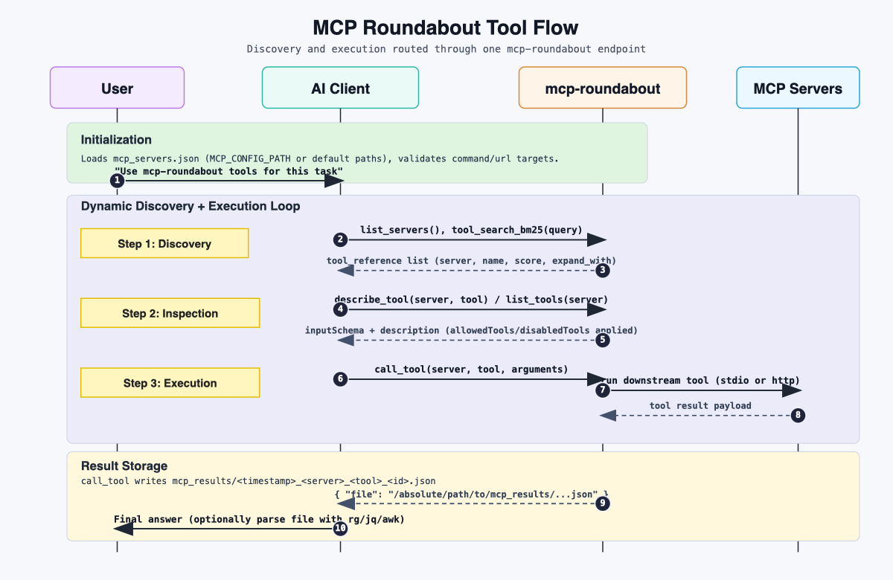

# MCP Roundabout

`mcp-roundabout` is a single MCP server that routes tool discovery and tool calls to other MCP servers defined in `mcp_servers.json`.



Diagram: one `mcp-roundabout` endpoint routes discovery (`list_servers`, `tool_search_*`, `describe_tool`) and execution (`call_tool`) to downstream MCP servers, then stores each response under `mcp_results/` and returns only the result file path.

## Context and Token Impact

For this workflow, deferring full tool schemas until needed can cut MCP-related token overhead by roughly 99%.

As you add more MCP integrations (GitHub, databases, browser automation, and others), tool definitions can consume a large share of usable context. That usually means:

- Less room for reasoning and code generation
- More frequent context compaction that breaks iteration flow
- Practical limits on how many MCP servers can be active at once
- Higher API spend from extra input tokens

### Dynamic Context Discovery

`mcp-roundabout` uses dynamic context discovery instead of static preloading. Rather than injecting every tool definition up front, the agent discovers candidate tools first, then expands only the ones relevant to the current task.

## What It Does

- Exposes one MCP endpoint (`streamable-http`)
- Connects to downstream MCP servers over:
  - `stdio` (`command` + `args`)
  - `http` (`url`)
- Supports per-server tool filtering:
  - `allowedTools`
  - `disabledTools`
- Stores downstream tool call results to files in `mcp_results/`
- Returns only the result file path from `call_tool`

## SKILL.md

This repo includes a Codex/Claude skill for working with `mcp-roundabout`. Copy it to `~/.claude/skills/mcp-roundabout` or project directory. It is not needed to lauch this repo, you can find the instructions to launch it from this README.md.

- `SKILL.md`

Purpose of the skill:

- Treat `mcp-roundabout` as the primary source of truth for downstream tool discovery
- Use `list_servers`, `list_tools`, `describe_tool`, `grep_tools`, and `call_tool` instead of assuming downstream tools are directly available
- Prefer parsing `call_tool` output files with shell tools (`rg`, `grep`, `jq`, `sed`, `awk`) to avoid bloating chat context with raw payloads

## Requirements

- Python 3.10+
- Packages in `requirements.txt`

Install:

```bash
python3 -m pip install -r requirements.txt
```

## Configuration

`mcp-roundabout.py` loads config from:

1. `MCP_CONFIG_PATH` (if set)
2. `./mcp_servers.json`
3. `~/.mcp_servers.json`
4. `~/.config/mcp/mcp_servers.json`

Example `mcp_servers.json`:

```json
{
  "mcpServers": {
    "filesystem": {
      "command": "npx",
      "args": ["-y", "@modelcontextprotocol/server-filesystem", "."]
    },
    "remote-docs": {
      "url": "https://example.com/mcp"
    }
  }
}
```

HTTP downstream server example:

```json
{
  "mcpServers": {
    "remote-docs": {
      "url": "https://example.com/mcp"
    }
  }
}
```

Optional filters per server:

```json
{
  "mcpServers": {
    "filesystem": {
      "command": "npx",
      "args": ["-y", "@modelcontextprotocol/server-filesystem", "."],
      "allowedTools": ["read_*", "list_*"],
      "disabledTools": ["delete_*"]
    }
  }
}
```

## Run

```bash
python3 mcp-roundabout.py
```

Start and initialize all configured downstream servers before serving requests:

```bash
python3 mcp-roundabout.py --start-all-servers
```

Use a specific config file:

```bash
python3 mcp-roundabout.py --start-all-servers --config-path /absolute/path/to/mcp_servers.json
```

`--start-all-servers` fails fast if any downstream server cannot be reached.

Default endpoint:

- `http://127.0.0.1:5052/mcp`

Environment variables:

- `MCP_META_HOST` (default: `127.0.0.1`)
- `MCP_META_PORT` (default: `5052`)
- `MCP_CONFIG_PATH` (optional config file path)

## HTTP Client Example

Example MCP client config pointing to this server:

```json
{
  "mcpServers": {
    "mcp-roundabout": {
      "url": "http://127.0.0.1:5052/mcp"
    }
  }
}
```

## Exposed Tools

- `list_servers(config_path?)`
- `list_tools(server, with_descriptions?, config_path?)`
- `describe_tool(server, tool, config_path?)`
- `grep_tools(pattern, with_descriptions?, config_path?)`
- `tool_search_regex(pattern, max_results?, search_descriptions?, config_path?)`
- `tool_search_bm25(query, max_results?, config_path?)`
- `call_tool(server, tool, arguments?, config_path?)`

`tool_search_*` tools return `tool_reference` records (3-5 results) with:

- `server`
- `name`
- `description`
- `expand_with: { tool: "describe_tool", arguments: { server, tool } }`

This lets an upstream LLM client keep most tool definitions deferred and expand only relevant tools.

## Tool Search Pattern

Include one search tool and let your client expand additional tool definitions from returned `tool_reference` entries.

Regex variant:

```json
{
  "name": "tool_search_regex",
  "input_schema": {
    "type": "object",
    "properties": {
      "pattern": { "type": "string" }
    },
    "required": ["pattern"]
  }
}
```

BM25 variant:

```json
{
  "name": "tool_search_bm25",
  "input_schema": {
    "type": "object",
    "properties": {
      "query": { "type": "string" }
    },
    "required": ["query"]
  }
}
```

Tool visibility/loading behavior is controlled by your MCP client runtime/config, not by `mcp-roundabout`'s downstream `mcp_servers.json`.

## Result Storage

`call_tool` writes a JSON record under `mcp_results/` and returns:

```json
{
  "file": "/absolute/path/to/mcp_results/<timestamp>_<server>_<tool>_<id>.json"
}
```

Each result file includes metadata (`timestamp`, `server`, `tool`, `arguments`, `result`, `config_path`).
