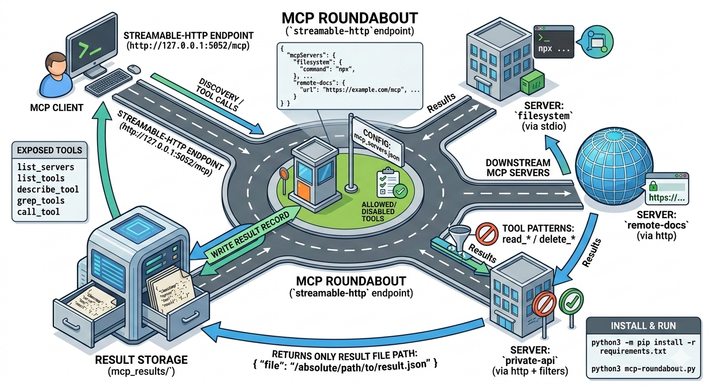

# MCP Roundabout

`mcp-roundabout` is a single MCP server that routes tool discovery and tool calls to other MCP servers defined in `mcp_servers.json`.



Diagram: one `mcp-roundabout` endpoint routes discovery and tool calls to multiple downstream MCP servers, and `call_tool` writes each response to a JSON file.

## What It Does

- Exposes one MCP endpoint (`streamable-http`)
- Connects to downstream MCP servers over:
  - `stdio` (`command` + `args`)
  - `http` (`url`)
- Supports per-server tool filtering:
  - `allowedTools`
  - `disabledTools`
- Stores downstream tool call results to files in `mcp_results/`
- Returns only the result file path from `call_tool`

## Requirements

- Python 3.10+
- Packages in `requirements.txt`

Install:

```bash
python3 -m pip install -r requirements.txt
```

## Configuration

`mcp-roundabout.py` loads config from:

1. `MCP_CONFIG_PATH` (if set)
2. `./mcp_servers.json`
3. `~/.mcp_servers.json`
4. `~/.config/mcp/mcp_servers.json`

Example `mcp_servers.json`:

```json
{
  "mcpServers": {
    "filesystem": {
      "command": "npx",
      "args": ["-y", "@modelcontextprotocol/server-filesystem", "."]
    },
    "remote-docs": {
      "url": "https://example.com/mcp"
    }
  }
}
```

HTTP downstream server example:

```json
{
  "mcpServers": {
    "remote-docs": {
      "url": "https://example.com/mcp"
    }
  }
}
```

HTTP server with headers/timeout:

```json
{
  "mcpServers": {
    "private-api": {
      "url": "https://example.com/mcp",
      "headers": {
        "Authorization": "Bearer <token>"
      },
      "timeout": 30
    }
  }
}
```

Optional filters per server:

```json
{
  "mcpServers": {
    "filesystem": {
      "command": "npx",
      "args": ["-y", "@modelcontextprotocol/server-filesystem", "."],
      "allowedTools": ["read_*", "list_*"],
      "disabledTools": ["delete_*"]
    }
  }
}
```

## Run

```bash
python3 mcp-roundabout.py
```

Default endpoint:

- `http://127.0.0.1:5052/mcp`

Environment variables:

- `MCP_META_HOST` (default: `127.0.0.1`)
- `MCP_META_PORT` (default: `5052`)
- `MCP_CONFIG_PATH` (optional config file path)

## HTTP Client Example

Example MCP client config pointing to this server:

```json
{
  "mcpServers": {
    "mcp-roundabout": {
      "url": "http://127.0.0.1:5052/mcp"
    }
  }
}
```

## Exposed Tools

- `list_servers(config_path?)`
- `list_tools(server, with_descriptions?, config_path?)`
- `describe_tool(server, tool, config_path?)`
- `grep_tools(pattern, with_descriptions?, config_path?)`
- `call_tool(server, tool, arguments?, config_path?)`

## Result Storage

`call_tool` writes a JSON record under `mcp_results/` and returns:

```json
{
  "file": "/absolute/path/to/mcp_results/<timestamp>_<server>_<tool>_<id>.json"
}
```

Each result file includes metadata (`timestamp`, `server`, `tool`, `arguments`, `result`, `config_path`).
